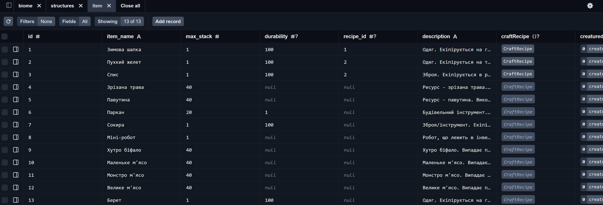
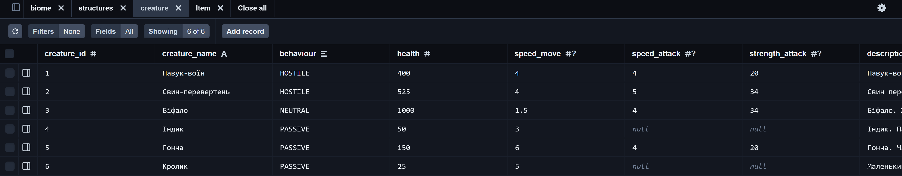
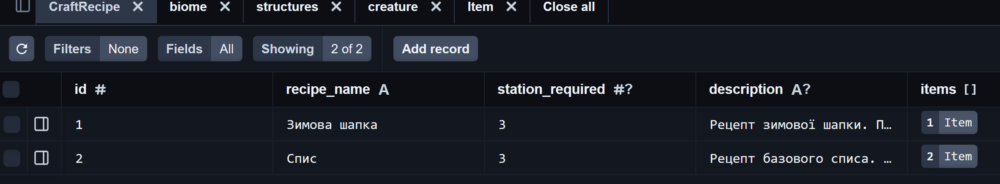
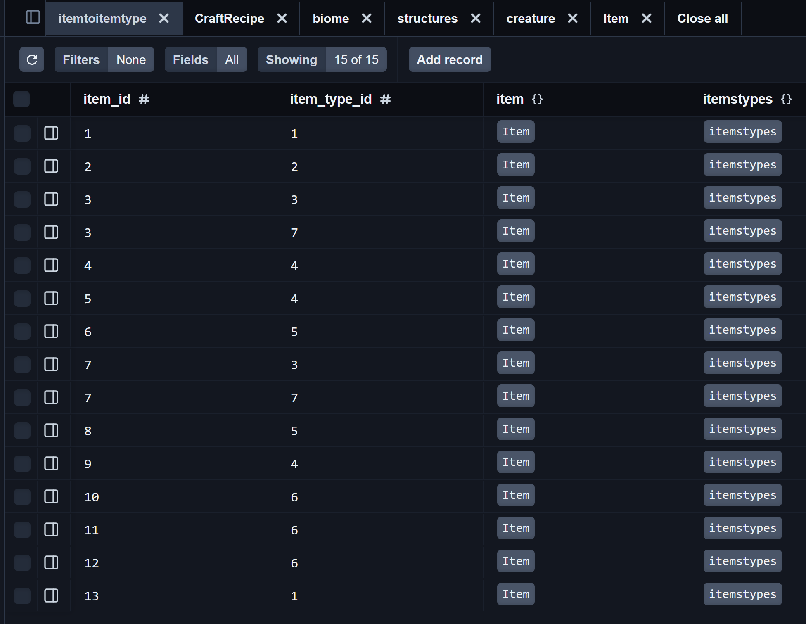

# Звіт лабораторна 6

---

## Міграція 1: add-craft-recipe-table
Опис: додано нову модель CraftRecipe, яка зберігатиме необхідні дані, тобто до якого предмету вона, сам рецепт та яка станція має бути.

Зміни в schema.prisma
```
model CraftRecipe {
  id          Int    @id @default(autoincrement())
  recipe_name String
  station_required Int?
  description String?

  items       Item[] @relation("CraftRecipeItems")
}
```
sql:
```CREATE TABLE "CraftRecipe" (
    "id" SERIAL NOT NULL,
    "name" TEXT NOT NULL,
    "description" TEXT NOT NULL,

    CONSTRAINT "CraftRecipe_pkey" PRIMARY KEY ("id")
);
-- AddForeignKey
ALTER TABLE "biomestructure" ADD CONSTRAINT "biomestructure_biome_id_fkey" FOREIGN KEY ("biome_id") REFERENCES "biome"("biome_id") ON DELETE NO ACTION ON UPDATE NO ACTION;

-- AddForeignKey
ALTER TABLE "biomestructure" ADD CONSTRAINT "biomestructure_structure_id_fkey" FOREIGN KEY ("structure_id") REFERENCES "structures"("structure_id") ON DELETE NO ACTION ON UPDATE NO ACTION;

-- AddForeignKey
ALTER TABLE "characterfeature" ADD CONSTRAINT "characterfeature_character_id_fkey" FOREIGN KEY ("character_id") REFERENCES "gamecharacter"("character_id") ON DELETE NO ACTION ON UPDATE NO ACTION;

-- AddForeignKey
ALTER TABLE "characterfeature" ADD CONSTRAINT "characterfeature_feature_id_fkey" FOREIGN KEY ("feature_id") REFERENCES "featureskill"("feature_id") ON DELETE NO ACTION ON UPDATE NO ACTION;

-- AddForeignKey
ALTER TABLE "creaturebiome" ADD CONSTRAINT "creaturebiome_biome_id_fkey" FOREIGN KEY ("biome_id") REFERENCES "biome"("biome_id") ON DELETE NO ACTION ON UPDATE NO ACTION;

-- AddForeignKey
ALTER TABLE "creaturebiome" ADD CONSTRAINT "creaturebiome_creature_id_fkey" FOREIGN KEY ("creature_id") REFERENCES "creature"("creature_id") ON DELETE NO ACTION ON UPDATE NO ACTION;

-- AddForeignKey
ALTER TABLE "creaturedrop" ADD CONSTRAINT "creaturedrop_creature_id_fkey" FOREIGN KEY ("creature_id") REFERENCES "creature"("creature_id") ON DELETE NO ACTION ON UPDATE NO ACTION;

-- AddForeignKey
ALTER TABLE "creaturedrop" ADD CONSTRAINT "creaturedrop_item_id_fkey" FOREIGN KEY ("item_id") REFERENCES "Item"("item_id") ON DELETE NO ACTION ON UPDATE NO ACTION;

-- AddForeignKey
ALTER TABLE "creatureforseason" ADD CONSTRAINT "creatureforseason_creature_id_fkey" FOREIGN KEY ("creature_id") REFERENCES "creature"("creature_id") ON DELETE NO ACTION ON UPDATE NO ACTION;

-- AddForeignKey
ALTER TABLE "creatureforseason" ADD CONSTRAINT "creatureforseason_season_id_fkey" FOREIGN KEY ("season_id") REFERENCES "season"("season_id") ON DELETE NO ACTION ON UPDATE NO ACTION;

-- AddForeignKey
ALTER TABLE "eventforseason" ADD CONSTRAINT "eventforseason_event_id_fkey" FOREIGN KEY ("event_id") REFERENCES "events"("event_id") ON DELETE NO ACTION ON UPDATE NO ACTION;

-- AddForeignKey
ALTER TABLE "eventforseason" ADD CONSTRAINT "eventforseason_season_id_fkey" FOREIGN KEY ("season_id") REFERENCES "season"("season_id") ON DELETE NO ACTION ON UPDATE NO ACTION;

-- AddForeignKey
ALTER TABLE "Item" ADD CONSTRAINT "Item_recipe_id_fkey" FOREIGN KEY ("recipe_id") REFERENCES "CraftRecipe"("id") ON DELETE SET NULL ON UPDATE CASCADE;

-- AddForeignKey
ALTER TABLE "itemsinbiome" ADD CONSTRAINT "itemsinbiome_biome_id_fkey" FOREIGN KEY ("biome_id") REFERENCES "biome"("biome_id") ON DELETE NO ACTION ON UPDATE NO ACTION;

-- AddForeignKey
ALTER TABLE "itemsinbiome" ADD CONSTRAINT "itemsinbiome_item_id_fkey" FOREIGN KEY ("item_id") REFERENCES "Item"("item_id") ON DELETE NO ACTION ON UPDATE NO ACTION;

-- AddForeignKey
ALTER TABLE "itemtoitemtype" ADD CONSTRAINT "itemtoitemtype_item_id_fkey" FOREIGN KEY ("item_id") REFERENCES "Item"("item_id") ON DELETE NO ACTION ON UPDATE NO ACTION;

-- AddForeignKey
ALTER TABLE "itemtoitemtype" ADD CONSTRAINT "itemtoitemtype_item_type_id_fkey" FOREIGN KEY ("item_type_id") REFERENCES "itemstypes"("item_type_id") ON DELETE NO ACTION ON UPDATE NO ACTION;

-- AddForeignKey
ALTER TABLE "itemtypefood" ADD CONSTRAINT "itemtypefood_item_id_fkey" FOREIGN KEY ("item_id") REFERENCES "Item"("item_id") ON DELETE NO ACTION ON UPDATE NO ACTION;

-- AddForeignKey
ALTER TABLE "startitem" ADD CONSTRAINT "startitem_character_id_fkey" FOREIGN KEY ("character_id") REFERENCES "gamecharacter"("character_id") ON DELETE NO ACTION ON UPDATE NO ACTION;

-- AddForeignKey
ALTER TABLE "startitem" ADD CONSTRAINT "startitem_item_id_fkey" FOREIGN KEY ("item_id") REFERENCES "Item"("item_id") ON DELETE NO ACTION ON UPDATE NO ACTION;

-- AddForeignKey
ALTER TABLE "structurecreature" ADD CONSTRAINT "structurecreature_creature_id_fkey" FOREIGN KEY ("creature_id") REFERENCES "creature"("creature_id") ON DELETE NO ACTION ON UPDATE NO ACTION;

-- AddForeignKey
ALTER TABLE "structurecreature" ADD CONSTRAINT "structurecreature_structure_id_fkey" FOREIGN KEY ("structure_id") REFERENCES "structures"("structure_id") ON DELETE NO ACTION ON UPDATE NO ACTION;

-- AddForeignKey
ALTER TABLE "structureevent" ADD CONSTRAINT "structureevent_event_id_fkey" FOREIGN KEY ("event_id") REFERENCES "events"("event_id") ON DELETE NO ACTION ON UPDATE NO ACTION;

-- AddForeignKey
ALTER TABLE "structureevent" ADD CONSTRAINT "structureevent_structure_id_fkey" FOREIGN KEY ("structure_id") REFERENCES "structures"("structure_id") ON DELETE NO ACTION ON UPDATE NO ACTION;

-- AddForeignKey
ALTER TABLE "summoncreature" ADD CONSTRAINT "summoncreature_creature_id_fkey" FOREIGN KEY ("creature_id") REFERENCES "creature"("creature_id") ON DELETE NO ACTION ON UPDATE NO ACTION;

-- AddForeignKey
ALTER TABLE "summoncreature" ADD CONSTRAINT "summoncreature_event_id_fkey" FOREIGN KEY ("event_id") REFERENCES "events"("event_id") ON DELETE NO ACTION ON UPDATE NO ACTION;
```

## Міграція2: add-recipe_id_field

Опис: Одразу видаляємо зайве поле, в яке раніше статично вносили зміни (recipe_id) та додаємо нове поле, що тепер пов'язане з CraftRecipe

Зміни в schema.prisma
```
model CraftRecipe {
  id          Int    @id @default(autoincrement())
  recipe_name String
  station_required Int?
  description String?

  items       Item[] @relation("CraftRecipeItems")
}

item                  Item     @relation(fields: [item_id], references: [id], onDelete: NoAction, onUpdate: NoAction)
рядок вище в ьагатьох помінявся

model Item {
  id          Int     @id @default(autoincrement())
  item_name   String
  max_stack   Int
  durability  Int?
  recipe_id   Int?       
  description String

  craftRecipe CraftRecipe? @relation("CraftRecipeItems", fields: [recipe_id], references: [id])

  creaturedrops creaturedrop[]
  itemsInBiomes itemsinbiome[]
  itemToItemTypes itemtoitemtype[]
  startItems startitem[]
  itemTypeFoods itemtypefood[]
}
```

sql:
```
-- DropForeignKey
ALTER TABLE "creaturedrop" DROP CONSTRAINT "creaturedrop_item_id_fkey";

-- DropForeignKey
ALTER TABLE "itemsinbiome" DROP CONSTRAINT "itemsinbiome_item_id_fkey";

-- DropForeignKey
ALTER TABLE "itemtoitemtype" DROP CONSTRAINT "itemtoitemtype_item_id_fkey";

-- DropForeignKey
ALTER TABLE "itemtypefood" DROP CONSTRAINT "itemtypefood_item_id_fkey";

-- DropForeignKey
ALTER TABLE "startitem" DROP CONSTRAINT "startitem_item_id_fkey";

-- DropIndex
DROP INDEX "CraftRecipe_name_key";

-- DropIndex
DROP INDEX "Item_recipe_id_key";

-- AlterTable
ALTER TABLE "CraftRecipe" DROP COLUMN "name",
ADD COLUMN     "recipe_name" TEXT NOT NULL,
ADD COLUMN     "station_required" INTEGER,
ALTER COLUMN "description" DROP NOT NULL;

-- AlterTable
ALTER TABLE "Item" DROP CONSTRAINT "Item_pkey",
DROP COLUMN "item_id",
ADD COLUMN     "id" SERIAL NOT NULL,
ALTER COLUMN "item_name" SET DATA TYPE TEXT,
ALTER COLUMN "max_stack" SET DATA TYPE INTEGER,
ALTER COLUMN "durability" SET DATA TYPE INTEGER,
ADD CONSTRAINT "Item_pkey" PRIMARY KEY ("id");

-- AlterTable
ALTER TABLE "itemtypefood" ADD CONSTRAINT "itemtypefood_pkey" PRIMARY KEY ("item_id", "food_characteristic");

-- AddForeignKey
ALTER TABLE "creaturedrop" ADD CONSTRAINT "creaturedrop_item_id_fkey" FOREIGN KEY ("item_id") REFERENCES "Item"("id") ON DELETE NO ACTION ON UPDATE NO ACTION;

-- AddForeignKey
ALTER TABLE "itemsinbiome" ADD CONSTRAINT "itemsinbiome_item_id_fkey" FOREIGN KEY ("item_id") REFERENCES "Item"("id") ON DELETE NO ACTION ON UPDATE NO ACTION;

-- AddForeignKey
ALTER TABLE "itemtoitemtype" ADD CONSTRAINT "itemtoitemtype_item_id_fkey" FOREIGN KEY ("item_id") REFERENCES "Item"("id") ON DELETE NO ACTION ON UPDATE NO ACTION;

-- AddForeignKey
ALTER TABLE "itemtypefood" ADD CONSTRAINT "itemtypefood_item_id_fkey" FOREIGN KEY ("item_id") REFERENCES "Item"("id") ON DELETE NO ACTION ON UPDATE NO ACTION;

-- AddForeignKey
ALTER TABLE "startitem" ADD CONSTRAINT "startitem_item_id_fkey" FOREIGN KEY ("item_id") REFERENCES "Item"("id") ON DELETE NO ACTION ON UPDATE NO ACTION;
```

## Перевірка результатів:
Команда ```npx dotenv -e ./.env -- npx prisma studio```

## Скріншоти перевірки:




